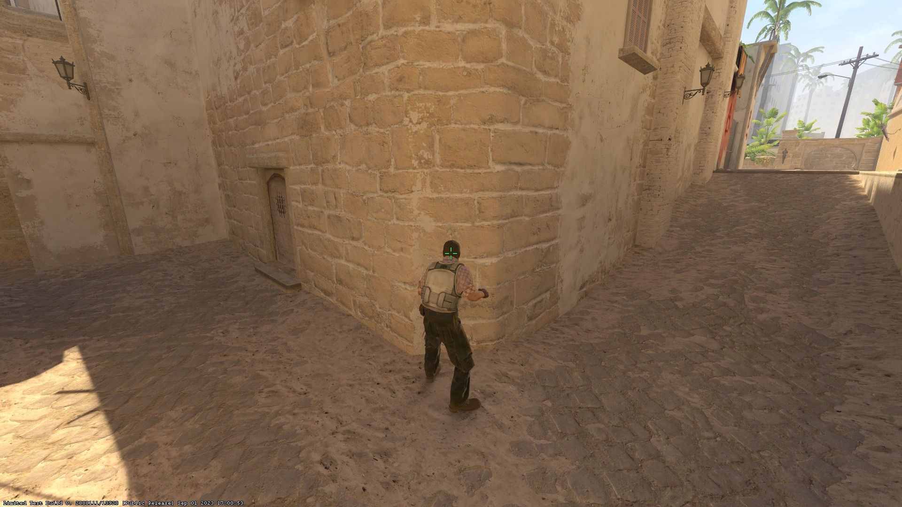

<a href="./mirage_nades.md" class="back-to-previous">⬅️ Back to Previous Page</a>
## How to Throw the Smoke

### Step-by-Step Guide

1. **Positioning**
    
    - Description of where to stand.

2. **Aiming and Throwing**
    
    - Description of where to aim.

3. **Throwing**
    
    - Description of how to throw the smoke.

### Video Tutorial

For a detailed walkthrough, watch the video below:

[Watch the Video](path/to/video.mp4)

### Additional Tips

- Tip 1: ...
- Tip 2: ...
- Tip 3: ...

<a href="./mirage_nades.md" class="back-to-previous">⬅️ Back to Previous Page</a>
