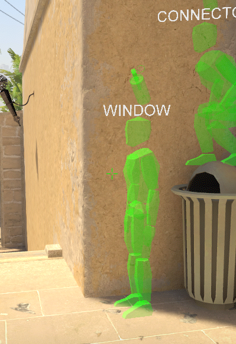
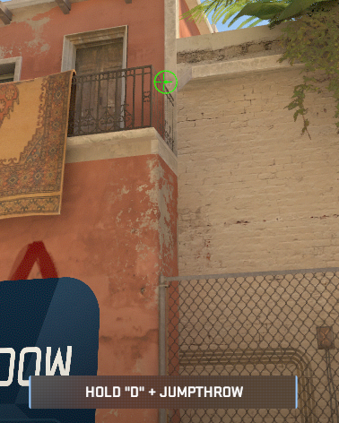

# Mirage - Tactics & Smokes

## T-Side

  
Window Smoke

  
  ### Heading
  1. Stand in front of Trashcan
  2. Look at corner of balcony
     
 

  
Connector Smoke

  
  ### Heading
  1. Stand in front of Trashcan
  2. Look at corner of balcony
     
 

  

  
Short Smoke

  
  ### Heading
  1. Stand in front of Trashcan
  2. Look at corner of balcony
     
 

  
A Stairs Smoke

  
  ### Heading
  1. Stand in front of Trashcan
  2. Look at corner of balcony
     
 

